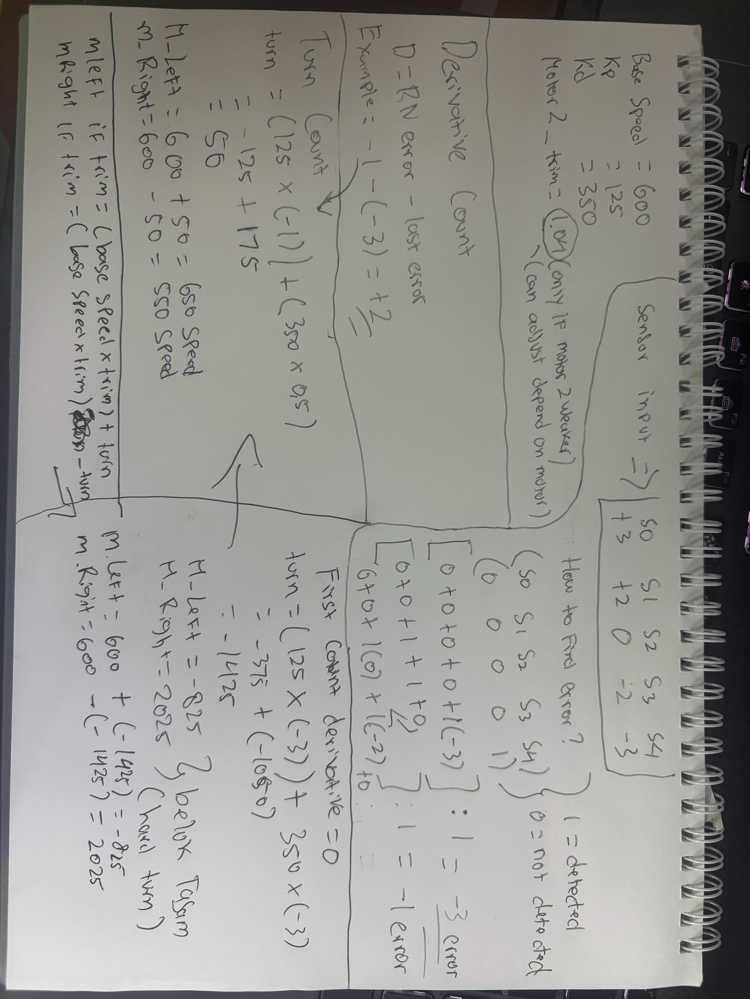
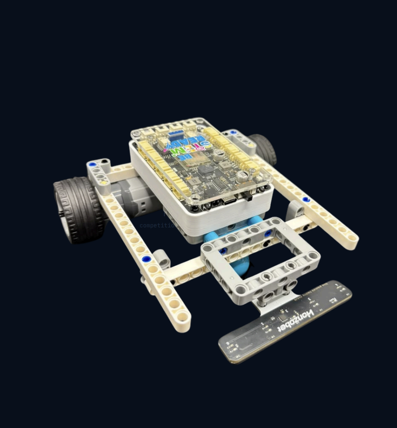

# ESP32 Line Follower Robot

Autonomous line-following robot programs for an ESP32 (FireBeetle ESP32-E)
based robot car, built and tuned during a STEM Education & Robotics
internship at Be STEM Ready. Two variants are included, each solving a
different competition challenge using the same 5-channel line sensor array.

## Hardware

- **Board:** DFRobot FireBeetle ESP32-E
- **Sensor:** 5-channel line tracker array (`s0`–`s4`, left to right)
- **Driver:** Dual DC motor driver via `line_tracker` library

## 1. Obstacle Race — [`obstacle-race/`](obstacle-race/)

A state-machine program that follows a line, drives blind through a wooden
ramp obstacle ("tanjakan kayu") where the line is temporarily invisible to
the sensors, then re-acquires the line and stops at the finish.

States: wait for start button → initial straight drive → follow line →
line lost → drive straight through the obstacle (ignoring the line) →
re-acquire and follow the line → stop.

Includes a "last known direction" fallback so the robot keeps turning the
way it was already turning if the line disappears for an instant (sharp
turns, sensor gaps), instead of stopping or going straight.

## 2. PID Speed Control — [`pid-speed-control/`](pid-speed-control/)

A faster, PD-controlled (Proportional-Derivative) line follower tuned for
speed runs. Reads all 5 sensors every cycle, computes a weighted error
based on which sensors see the line, and continuously corrects motor speed
— rather than the simpler "turn left/right" branching logic used in the
obstacle race version.

Three tuned variants are included depending on which motor turned out to be
mechanically weaker on the actual robot:

- `line_follower_pd_base.ino` — both motors equal, no trim
- `line_follower_pd_m1_weaker.ino` — motor 1 compensated with trim
- `line_follower_pd_m2_weaker.ino` — motor 2 compensated with trim, higher-gain tune

See [`pid-speed-control/TUNING_GUIDE.md`](pid-speed-control/TUNING_GUIDE.md)
for how to pick the right variant and tune `Kp`/`Kd`/trim — written to be
followable even without a programming background, since this was originally
written so the gain gets handed off to other interns/students.

## Robot

## Author

**Ryan Aric Ardhani**
